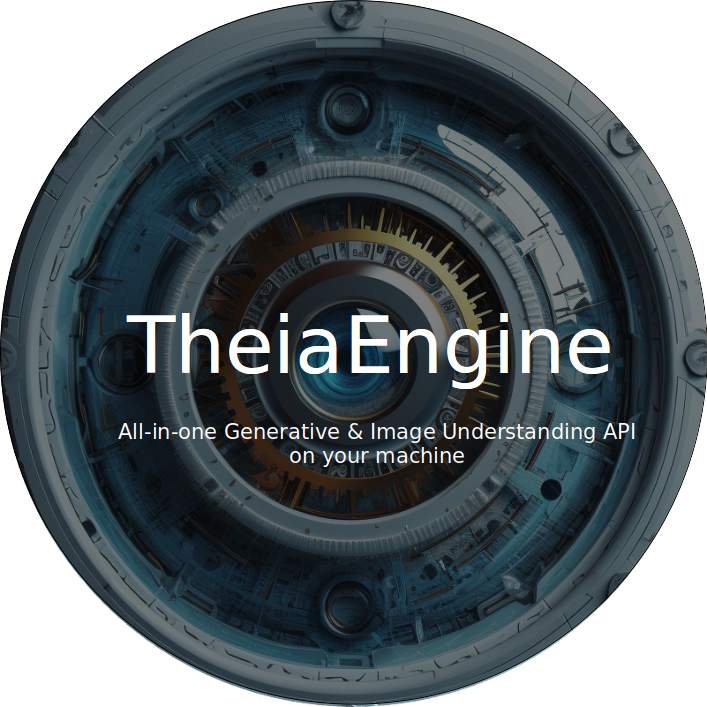
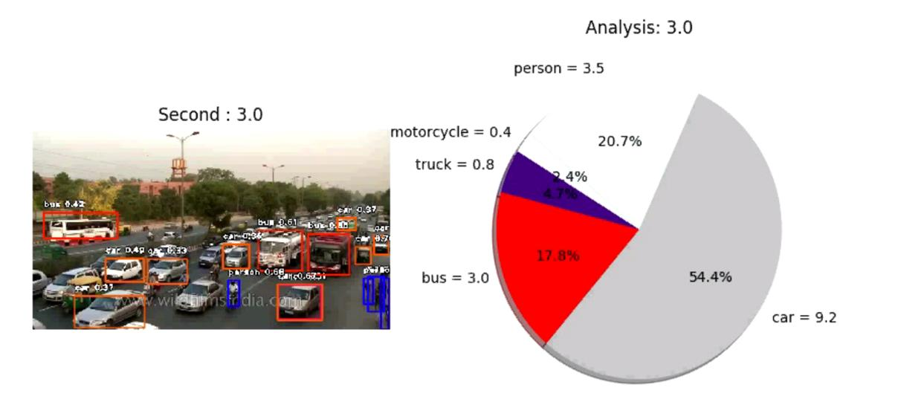
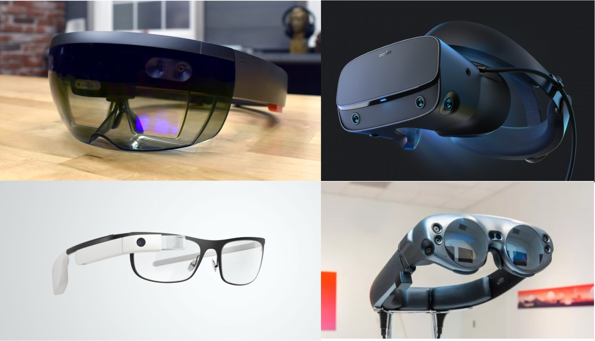
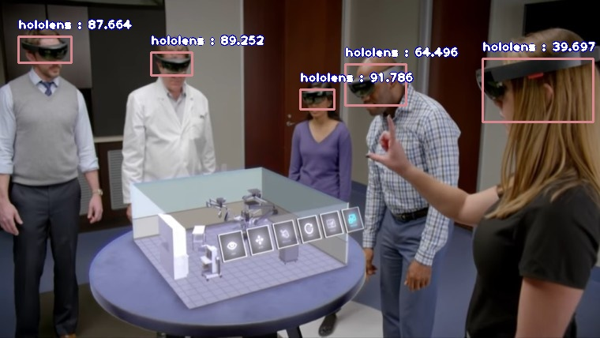
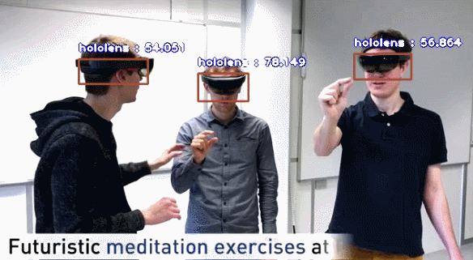

# ImageAI (v3.0.3)


An open-source python library built to empower developers to build applications and systems with self-contained Deep Learning and Computer Vision capabilities using simple and few lines of code.
 

 
 
## ---------------------------------------------------
## Introducing Jarvis and TheiaEngine.

We the creators of ImageAI are glad to announce 2 new AI projects to provide state-of-the-art Generative AI, LLM and Image Understanding on your personal computer and servers. 


[](https://jarvis.genxr.co)

Install Jarvis on PC/Mac to setup limitless access to LLM powered AI Chats for your every day work, research and generative AI needs with 100% privacy and full offline capability.


Visit [https://jarvis.genxr.co](https://jarvis.genxr.co/) to get started.


[](https://www.genxr.co/theia-engine)


[TheiaEngine](https://www.genxr.co/theia-engine), the next-generation computer Vision AI API capable of all Generative and Understanding computer vision tasks in a single API call and available via REST API to all programming languages. Features include
- **Detect 300+ objects** ( 220 more objects than ImageAI)
- **Provide answers to any content or context questions** asked on an image
  - very useful to get information on any object, action or information without needing to train a new custom model for every tasks
-  **Generate scene description and summary**
-  **Convert 2D image to 3D pointcloud and triangular mesh**
-  **Semantic Scene mapping of objects, walls, floors, etc**
-  **Stateless Face recognition and emotion detection**
-  **Image generation and augmentation from prompt**
-  etc.

Visit [https://www.genxr.co/theia-engine](https://www.genxr.co/theia-engine) to try the demo and join in the beta testing today.
## ---------------------------------------------------
 


---

Built with simplicity in mind, **ImageAI** 
    supports a list of state-of-the-art Machine Learning algorithms for image prediction, custom image prediction, object detection, video detection, video object tracking
    and image predictions trainings. **ImageAI** currently supports image prediction and training using 4 different Machine Learning algorithms 
    trained on the ImageNet-1000 dataset. **ImageAI** also supports object detection, video detection and object tracking  using RetinaNet, YOLOv3 and TinyYOLOv3 trained on COCO dataset. Finally, **ImageAI** allows you to train custom models for performing detection and recognition of new objects. 
   
Eventually, **ImageAI** will provide support for a wider and more specialized aspects of Computer Vision


**New Release : ImageAI 3.0.2**

What's new:
- PyTorch backend
- TinyYOLOv3 model training


## Installation
<div id="installation"></div>
 
To install ImageAI, run the python installation instruction below in the command line:

- [Download and Install](https://www.python.org/downloads/) **Python 3.7**, **Python 3.8**, **Python 3.9** or **Python 3.10**
- Install dependencies
  - **CPU**: Download [requirements.txt](https://github.com/OlafenwaMoses/ImageAI/blob/master/requirements.txt) file and install via the command
    ```
    pip install -r requirements.txt
    ```
    or simply copy and run the command below

    ```
    pip install cython pillow>=7.0.0 numpy>=1.18.1 opencv-python>=4.1.2 torch>=1.9.0 --extra-index-url https://download.pytorch.org/whl/cpu torchvision>=0.10.0 --extra-index-url https://download.pytorch.org/whl/cpu pytest==7.1.3 tqdm==4.64.1 scipy>=1.7.3 matplotlib>=3.4.3 mock==4.0.3
    ```

  - **GPU/CUDA**: Download [requirements_gpu.txt](https://github.com/OlafenwaMoses/ImageAI/blob/master/requirements_gpu.txt) file and install via the command
    ```
    pip install -r requirements_gpu.txt
    ```
    or smiply copy and run the command below
    ```
    pip install cython pillow>=7.0.0 numpy>=1.18.1 opencv-python>=4.1.2 torch>=1.9.0 --extra-index-url https://download.pytorch.org/whl/cu102 torchvision>=0.10.0 --extra-index-url https://download.pytorch.org/whl/cu102 pytest==7.1.3 tqdm==4.64.1 scipy>=1.7.3 matplotlib>=3.4.3 mock==4.0.3
    ```
- If you plan to train custom AI models, download [requirements_extra.txt](https://github.com/OlafenwaMoses/ImageAI/blob/master/requirements_extra.txt) file and install via the command
  
  ```
  pip install -r requirements_extra.txt
  ```
  or simply copy and run the command below
  ```
  pip install pycocotools@git+https://github.com/gautamchitnis/cocoapi.git@cocodataset-master#subdirectory=PythonAPI
  ```
- Then run the command below to install ImageAI
  ```
  pip install imageai --upgrade
  ```

## Features
<div id="features"></div>
<table>
  <tr>
    <td><h2> Image Classification</h2> </td>
  </tr>
  <tr>
    <td>
    <h4>ImageAI provides 4 different algorithms and model types to perform image prediction, trained on the ImageNet-1000 dataset. The 4 algorithms provided for image prediction include MobileNetV2, ResNet50, InceptionV3 and DenseNet121.
    Click the link below to see the full sample codes, explanations and best practices guide.</h4>
    </td>
  </tr>
  
 </table>

 <div id="features"></div>
<table>
  <tr>
    <td><h2> Object Detection </h2> </td>
  </tr>
  <tr>
    <td>
        
        <h4>ImageAI provides very convenient and powerful methods to perform object detection on images and extract each object from the image. The object detection class provides support for RetinaNet, YOLOv3 and TinyYOLOv3, with options to adjust for state of the art performance or real time processing. Click the link below to see the full sample codes, explanations and best practices guide.</h4>
    </td>
  </tr>
  
 </table>


<table>
  <tr>
    <td><h2> Video Object Detection & Analysis</h2> </td>
  </tr>
  <tr>
    <td>
    <h4>ImageAI provides very convenient and powerful methods to perform object detection in videos. The video object detection class provided only supports the current state-of-the-art RetinaNet. Click the link to see the full videos, sample codes, explanations and best practices guide.</h4>
    </td>
  </tr>
  
 </table>


 <table>
  <tr>
    <td><h2> Custom Classification model training </h2> </td>
  </tr>
  <tr>
    <td>
        
        <h4>ImageAI provides classes and methods for you to train a new model that can be used to perform prediction on your own custom objects. You can train your custom models using MobileNetV2, ResNet50, InceptionV3 and DenseNet in 5 lines of code. Click the link below to see the guide to preparing training images, sample training codes, explanations and best practices.</h4>
    </td>
  </tr>
  
 </table>

 <table>
  <tr>
    <td><h2> Custom Model Classification</h2> </td>
  </tr>
  <tr>
    <td>
    <h4>ImageAI provides classes and methods for you to run image prediction your own custom objects using your own model trained with ImageAI Model Training class. You can use your custom models trained with MobileNetV2, ResNet50, InceptionV3 and DenseNet and the JSON file containing the mapping of the custom object names. Click the link below to see the guide to sample training codes, explanations, and best practices guide.</h4>
    </td>
  </tr>
  
 </table>

 <table>
  <tr>
    <td><h2> Custom Detection Model Training </h2> </td>
  </tr>
  <tr>
    <td>
        
        <h4>ImageAI provides classes and methods for you to train new YOLOv3 or TinyYOLOv3 object detection models on your custom dataset. This means you can train a model to detect literally any object of interest by providing the images, the annotations and training with ImageAI. Click the link below to see the guide to sample training codes, explanations, and best practices guide.</h4>
    </td>
  </tr>
  
 </table>

<table>
  <tr>
    <td><h2> Custom Object Detection</h2> </td>
  </tr>
  <tr>
    <td>
    <h4>ImageAI now provides classes and methods for you detect and recognize your own custom objects in images using your own model trained with the DetectionModelTrainer class. You can use your custom trained YOLOv3 or TinyYOLOv3 model and the **.json** file generated during the training. Click the link below to see the guide to sample training codes, explanations, and best practices guide.</h4>
    </td>
  </tr>
 </table>


<table>
  <tr>
    <td><h2> Custom Video Object Detection & Analysis </h2> </td>
  </tr>
  <tr>
    <td>
        
        <h4>ImageAI now provides classes and methods for you detect and recognize your own custom objects in images using your own model trained with the DetectionModelTrainer class. You can use your custom trained YOLOv3 or TinyYOLOv3 model and the **.json** file generated during the training. Click the link below to see the guide to sample training codes, explanations, and best practices guide.</h4>
    </td>
  </tr>
 </table>


## Real-Time and High Performance Implementation
<div id="performance"></div>

**ImageAI** provides abstracted and convenient implementations of state-of-the-art Computer Vision technologies. All of **ImageAI** implementations and code can work on any computer system with moderate CPU capacity. However, the speed of processing for operations like image prediction, object detection and others on CPU is slow and not suitable for real-time applications. To perform real-time Computer Vision operations with high performance, you need to use GPU enabled technologies.

**ImageAI** uses the PyTorch backbone for it's Computer Vision operations. PyTorch supports both CPUs and GPUs ( Specifically NVIDIA GPUs.  You can get one for your PC or get a PC that has one) for machine learning and artificial intelligence algorithms' implementations.


## Projects Built on ImageAI
<div id="sample"></div>


## AI Practice Recommendations
<div id="recommendation"></div>

For anyone interested in building AI systems and using them for business, economic,  social and research purposes, it is critical that the person knows the likely positive, negative and unprecedented impacts the use of such technologies will have.
They must also be aware of approaches and practices recommended by experienced industry experts to ensure every use of AI brings overall benefit to mankind.
We therefore recommend to everyone that wishes to use ImageAI and other AI tools and resources to read Microsoft's January 2018 publication on AI titled "The Future Computed : Artificial Intelligence and its role in society".


